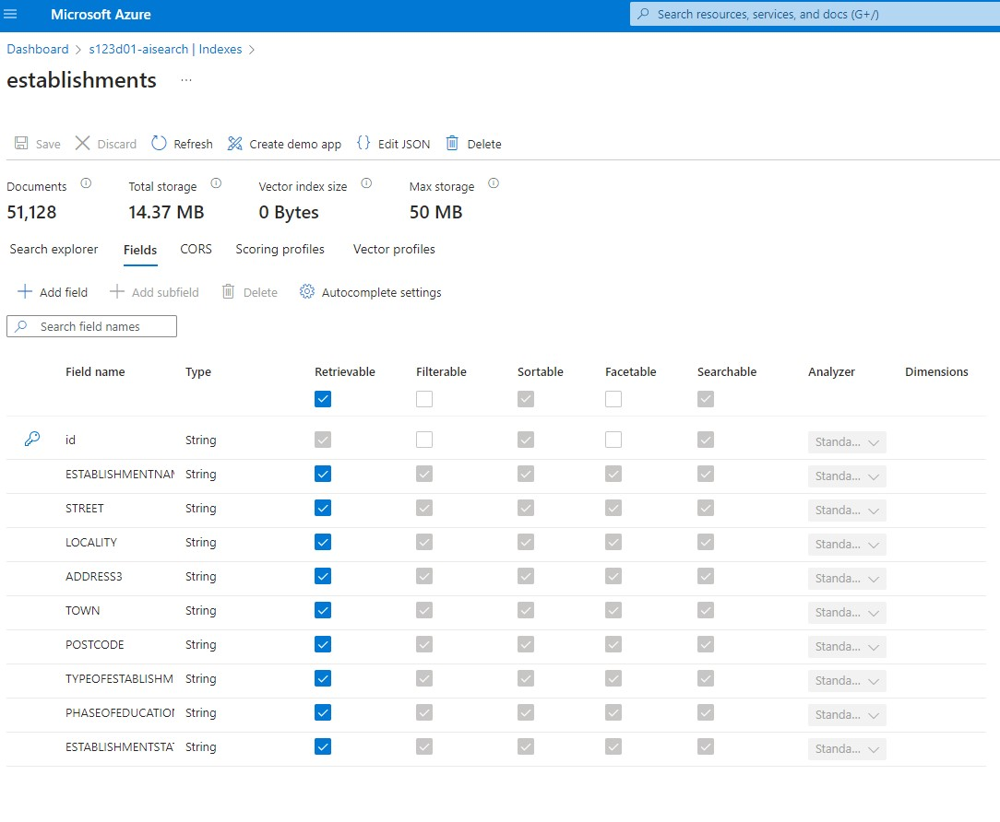
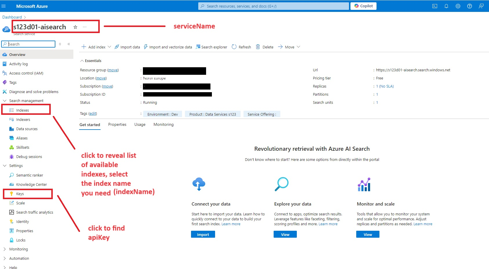

# data.search-prototype-data
Project created to manually push data from local file to Azure Search AI service

## File format
In order to upload data from your local file, you will need to use csv format. 
## Index
This has to be created prior to running the app to push the data. 

`id` field has been made:
- Retrievable
- Sortable
- Searchable

All remaining fields have been made:
- Retrievable
- Filterable
- Sortable
- Facetable
- Searchable

## Reference index field to data
`Dfe.Data.SearchPrototype.Data.DocumentBatchHelpers.ConvertBatchToJson` references:
`INDEX_FIELD = record.Column_header`
where: `INDEX_FIELD` has to match an index field in your Azure Search Service,
`record` is a row of your csv document and `Column_header` is a name of your column header.
## Configuration
To run the app in order to push your data, update:
- `appsettings.json` 
 Details needed to make a POST request to Azure Search service, as well as a path to your local file containing data.

 AzureSearchServiceDetails section contains information which you can get from your SearchService container on Azure.

- `secrets.json`
ensure to copy your `apiKey` into the secrets file and NOT appsettings!

Simply run the app using your IDE or command line to push the data and observe your command-line to see if the push was successful.
